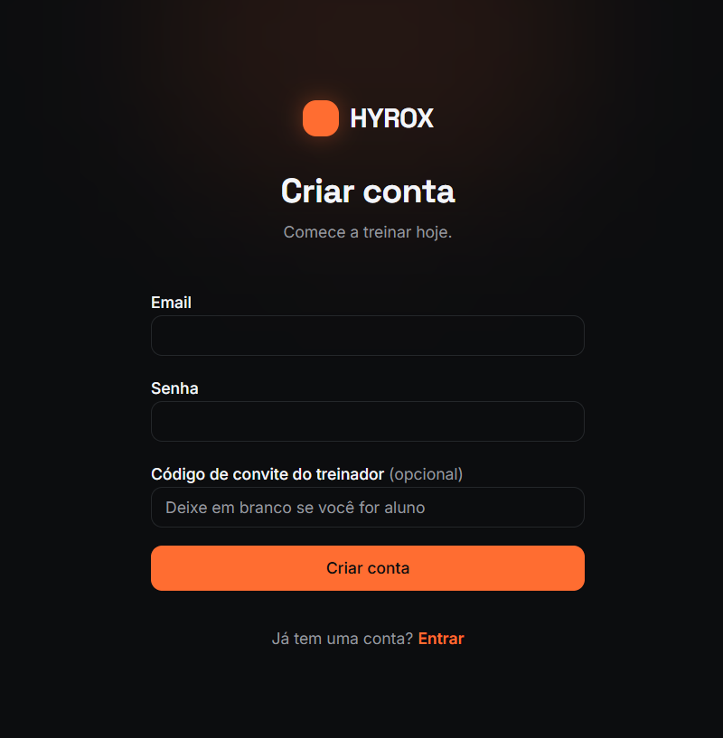

# Hyrox Hub — Plataforma para Treinos Hyrox
CI Deploy Cloudflare

App web de treinos focados na modalidade Hyrox. Treinadores (coaches) gerenciam alunos e treinos semanais, enquanto alunos visualizam suas planilhas, marcam conclusão e acompanham o progresso. Tudo com um visual dark premium focado em alta performance.

🚀 **App em produção**
https://hyrox-hub.maxwellngg.workers.dev

📱 **Screenshots**
| Landing | Cadastro | Login |
|---------|----------|-------|
|  |  |  |

✨ **Funcionalidades**

**Painel Coach (Treinador)**
- Criar, editar e remover treinos semanais
- Visualizar lista de alunos cadastrados
- Acompanhar progresso dos alunos
- Sistema de promoção a coach via código de convite (`COACH_INVITE_CODE`)

**App do Aluno**
- Visualização dos treinos programados para a semana
- Check-in de conclusão dos treinos
- Acompanhamento do progresso semanal (%)
- Autenticação e cadastro próprio

🛠️ **Stack**

| Camada | Tecnologia |
| --- | --- |
| Frontend | React 19 + TypeScript + Vite + TanStack Start |
| UI e Estilos | Tailwind CSS v4 + Radix UI / shadcn/ui |
| Backend | Supabase (Banco Postgres, Auth, RLS) |
| Deploy | Cloudflare Workers (`@cloudflare/vite-plugin`) |
| Gráficos/Datas | Recharts + date-fns |
| Formulários | React Hook Form + Zod |

📊 **Qualidade (Lighthouse Mobile)**
*(Métricas serão adicionadas após o deploy final e auditoria)*

| Categoria | Score |
| --- | --- |
| Performance | - |
| Acessibilidade | - |
| Boas Práticas | - |
| SEO | - |

🏃 **Como rodar localmente**

**Pré-requisitos**
- Node.js 22+
- Conta no Supabase

**Instalação**
```bash
git clone https://github.com/maxwellnasci/hyrox-hub.git
cd hyrox-hub
npm install
```

**Variáveis de ambiente**
Copie o arquivo `.env.example` para `.env` e preencha com suas credenciais:
```bash
VITE_SUPABASE_URL=sua_url_do_supabase
VITE_SUPABASE_PUBLISHABLE_KEY=sua_chave_anonima
SUPABASE_SERVICE_ROLE_KEY=chave_service_role
COACH_INVITE_CODE=seu_codigo_secreto_para_coach
```

**Rodar**
```bash
npm run dev
```

**Build**
```bash
npm run build
```

**Deploy (Cloudflare)**
```bash
npx wrangler deploy
```

🔒 **Segurança**
- RLS (Row Level Security) habilitado em todas as tabelas no Supabase
- Autenticação nativa e segura via Supabase Auth
- Secrets sensíveis configurados no ambiente Cloudflare (não commitados no repositório)

📁 **Estrutura do projeto**
```text
hyrox-hub/
  src/
    components/     # Componentes reutilizáveis (shadcn/ui e próprios)
    hooks/          # Hooks customizados e lógicas isoladas
    integrations/   # Cliente e configurações do Supabase
    lib/            # Funções helpers, utils (ex: cn) e lógica de servidor
    routes/         # Páginas baseadas no TanStack Router (File-based)
  supabase/
    migrations/     # Migrations SQL do banco de dados
  docs/
    MVP-PLAN.md     # Planejamento do MVP e roadmap
```

👤 **Sobre o projeto**
Desenvolvido por Maxwell — Consultor de automações de IA em Curitiba.

Este projeto foi construído utilizando um time de IA orquestrado:
- **Claude** — estratégia, arquitetura e revisão
- **Gemini** — implementação principal com subagentes paralelos
- **DeepSeek** — análise técnica e cálculos matemáticos
